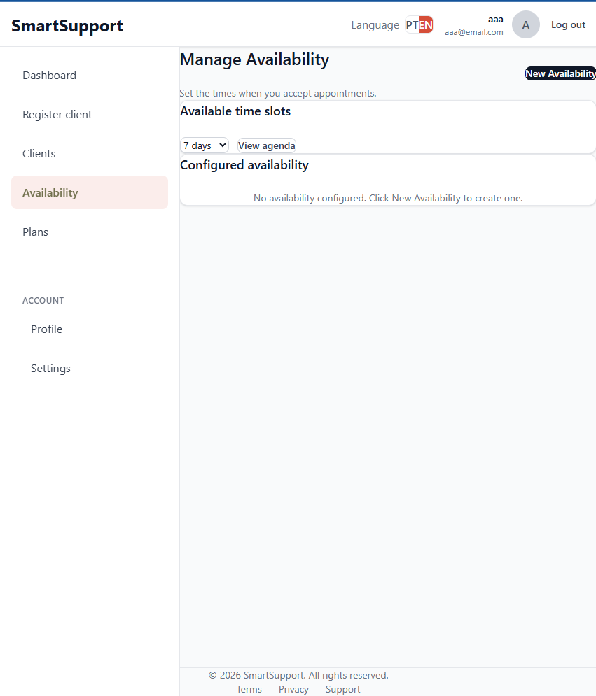
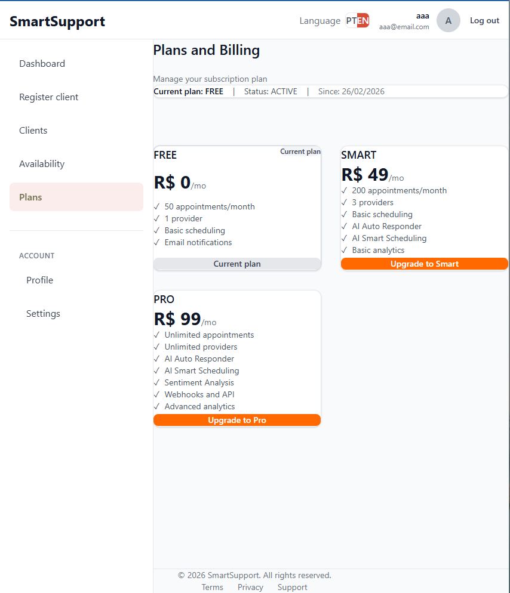
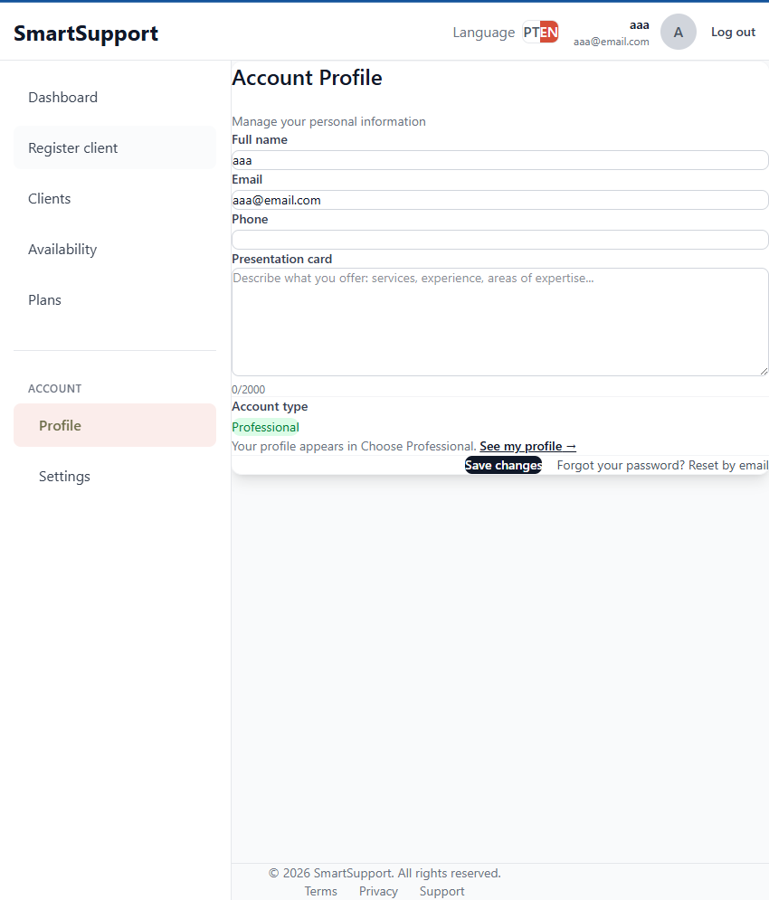

# SmartSupport — SaaS Scheduling Platform

SmartSupport is a full-stack SaaS scheduling platform designed for service providers and clients.

The system allows professionals to manage availability and appointments while enabling clients to book services with or without an account.

The project was built with a modern production-ready architecture including authentication, role-based access control, public booking flows, and scalable backend design.

---

## Live Demo

*(Add after deployment)*

| Service | URL |
|---------|-----|
| **Frontend** | https://yourdomain.com |
| **API** | https://api.yourdomain.com |

---

## Screenshots

Screenshots are stored in [`docs/`](./docs).

| Preview | Description |
|---------|-------------|
|  | Dashboard overview |
|  | Public booking flow |
|  | Availability management |
|  | Subscription plans |
|  | User profile |

---

## Architecture

```
smartsupport/
│
├── backend/        Node.js + Express + TypeScript API
├── frontend/       React + Vite + TypeScript
├── docs/           Screenshots
│
└── README.md
```

---

## Tech Stack

### Backend

- Node.js
- Express
- TypeScript
- Prisma ORM
- SQLite (development)
- PostgreSQL (production ready)
- JWT Authentication
- Bcrypt
- Zod Validation

### Frontend

- React 18
- TypeScript
- Vite
- React Router
- Axios
- TailwindCSS

---

## Core Features

### Authentication

- User registration
- Login and logout
- JWT authentication
- Refresh tokens
- Password reset via token
- Profile management
- Password change

### Roles

The system supports role-based access:

| Role | Description |
|------|-------------|
| **ADMIN** | System administration and user management |
| **PROVIDER** | Availability and appointment management |
| **CLIENT** | Booking and appointment management |

### Public Booking Flow

Clients can book appointments without creating an account.

**Flow**

1. Select provider
2. Select date and time
3. Create appointment
4. Receive confirmation link
5. Manage appointment using token

**Includes**

- Public provider listing
- Available time slots API
- Booking validation
- Conflict prevention
- Confirmation via public token

### Appointment System

**Features**

- Create appointments
- Edit appointments
- Cancel appointments
- Confirm appointments
- Appointment tracking

**Statuses**

`PENDING` · `CONFIRMED` · `CANCELLED` · `COMPLETED` · `NO_SHOW`

### Availability Management

Providers can configure:

- Weekly availability
- Time slots
- Slot duration
- Buffers between appointments
- Exceptions

### Admin Panel

Admin dashboard includes:

- User management
- Role management
- Activation and deactivation
- System metrics

### AI Integration

SmartSupport supports AI configuration per provider.

**Configuration**

- API key
- Model
- AI behavior

**Features**

- Automatic responses
- Smart scheduling suggestions

### Plans System

**Plan structure**

- **FREE**
- **PRO**

The architecture supports plan-based limitations.

---

## API Structure

```
/api/auth
/api/appointments
/api/availability
/api/admin
/api/ai
/api/billing
```

---

## Installation

### Requirements

- Node.js 18+
- npm or yarn
- No external database is required for development. SQLite is used by default.

### Backend Setup

```bash
cd backend
npm install
cp .env.example .env
```

Generate Prisma client:

```bash
npm run prisma:generate
```

Run migrations:

```bash
npm run prisma:migrate
```

Start backend:

```bash
npm run dev
```

Backend runs at: **http://localhost:3000**

### Frontend Setup

```bash
cd frontend
npm install
cp .env.example .env
```

Start frontend:

```bash
npm run dev
```

Frontend runs at: **http://localhost:5173**

---

## Environment Variables

### Backend

**Required**

```env
DATABASE_URL="file:./dev.db"
JWT_SECRET="your-secret"
JWT_ACCESS_TOKEN_EXPIRES_IN="15m"
JWT_REFRESH_TOKEN_EXPIRES_IN="7d"
```

**Optional**

```env
STRIPE_SECRET_KEY=
SMTP_HOST=
SMTP_USER=
SMTP_PASS=
OPENAI_API_KEY=
```

### Authentication Flow

1. User logs in
2. Backend returns Access Token and Refresh Token
3. Frontend stores tokens
4. Requests include Access Token
5. Refresh Token renews expired tokens

---

## Data Models

### User

`id` · `email` · `password` (hashed) · `role` · `plan` · `createdAt`

### Appointment

`id` · `providerId` · `clientId` · `clientName` · `clientEmail` · `startTime` · `endTime` · `status` · `publicToken`

### Availability

`id` · `providerId` · `dayOfWeek` · `startTime` · `endTime` · `slotDuration` · `bufferTime`

---

## Testing

### Backend

```bash
cd backend
npm run test
```

Includes:

- Zod schemas
- Validation middleware
- Date utilities

### Frontend

```bash
cd frontend
npm run test
```

Includes:

- Form validation
- Hooks testing

---

## Production Features

- JWT authentication
- Refresh tokens
- Public booking system
- Role-based access
- Input validation
- Error handling
- Modular architecture
- Prisma ORM
- REST API
- Environment configuration

---

## Future Improvements

- Stripe production integration
- Email provider integration
- Plan enforcement
- Advanced analytics
- Multi-tenant architecture

---

## License

Private project — Portfolio use.
